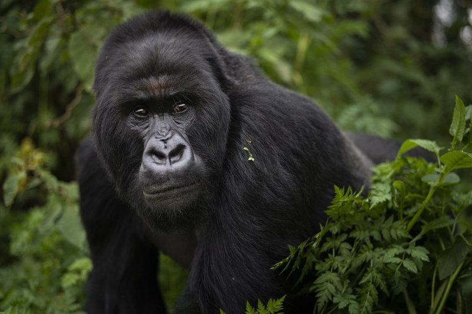

```{r setup, include=FALSE}
knitr::opts_chunk$set(echo = FALSE)
```

# I. Source Of The Article

- Learn More About This Article : *https://apnews.com/article/mountains-animals-demographics-rwanda-gorillas-3739502f048dc031cd26fc676b04c872*

- Publication Date : *November 4, 2020*

- Word Count : *605*


# II. Vocabulary
|     Word From The Text    |     Synomym/Definition   in inglish         |     French   Translation    |
|---------------------------|---------------------------------------------|-----------------------------|
|     Crowded               |     Throng                                  |     Surpeuplé, encombré     |
|     Chomping              |     Munch or chew vigorously and noisily    |     Grignoter, mâcher       |
|     Encounters            |     Run into someone                        |     Rencontres              |
|     Teetering             |     Totter, wobble                          |     Vacillant               |
|     Spanning              |     Straddle, stride over                   |     Couvrant                |
|     Witnessed             |     Be present at...                        |     Témoin                  |
|     Splintered            |     Shattered, broken                       |     Eclaté                  |
|     Able                  |     Qualified to…                           |     Capable                 |

# III. Analysis Table About The Study
|     Themes                                  |     Article Content                                                                                                                                                                                                                                                                                                                                                                                                                                                                                     |
|---------------------------------------------|---------------------------------------------------------------------------------------------------------------------------------------------------------------------------------------------------------------------------------------------------------------------------------------------------------------------------------------------------------------------------------------------------------------------------------------------------------------------------------------------------------|
|     Researchers ?                           |     Christina Larson                                                                                                                                                                                                                                                                                                                                                                                                                                                                                    |
|     Published In ? When ? *(if mentioned)*    |     Associated Press, 4   november 2020                                                                                                                                                                                                                                                                                                                                                                                                                                                                 |
|     General Topic                           |     A crowded mountain can make   silverback gorillas more violent.                                                                                                                                                                                                                                                                                                                                                                                                                                     |
|     Procedure/ What Was Examined ?          |     In Rwanda, male gorillas, known as “Silverback”   fight among themselves to defend females and infants. Scientists analyzed, using   demographic and behavioral data, that as the number of gorilla families increases in the   habitat, so does the number of violent clashes. As a result, some gorillas,   including infants, have died, causing population growth to slow down. But in   2007, three family groups broke up, and the population grew again.                                     |
|     Conclusions/ Discovery                  |     In the end,   three family groups broke up, and 10 groups appeared, the population grew   again. These groups are dispersed to occupy more territory. However, the   violent clashes between them have also increased and the growth rate   decreased. When the old gorillas died, the new males failed to keep the group   together. The study concluded that the frequency encounters between gorillas   was determined by the number of family groups, not the total number of   individuals.    |
|     Remaining Questions                     |     /                                                                                                                                                                                                                                                                                                                                                                                                                                                                                                   |
