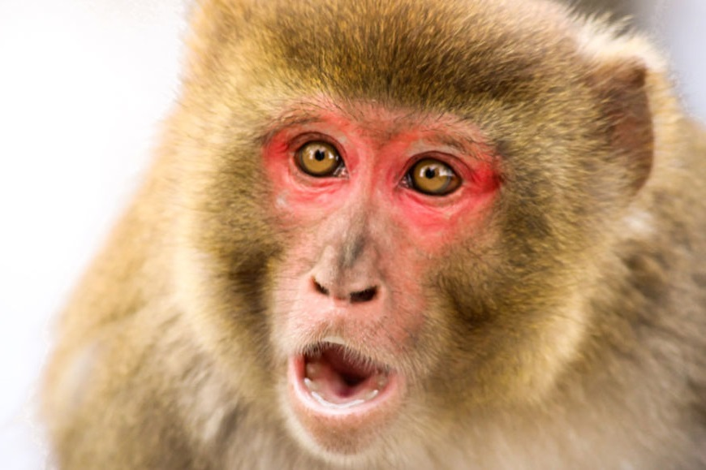

```{r setup, include=FALSE}
knitr::opts_chunk$set(echo = FALSE)
```

# I. Source Of The Article

- Learn More About This Article : *https://www.sciencenews.org/article/monkeys-may-share-key-grammar-related-skill-with-humans*

- Publication Date : *June 26, 2020*

- Word Count : *768*


# II. Vocabulary
|     Word From The Text    |     Synomym/Definition   in inglish                        |     French   Translation    |
|---------------------------|------------------------------------------------------------|-----------------------------|
|     Recursion             |     Repeated application   of a procedure or definition    |     Récursivité             |
|     Stringing             |     Enchain                                                |     Enchaîner               |
|     Hallmark              |     Characteristic                                         |     Caractéristique         |
|     Knowledge             |     Understanding, comprehension                           |     Connaissance            |
|     Rhesus                |     Macaque from northern India                            |     Rhésus                  |
|     Bracket               |     Parenthesis (support)                                  |     Parenthèse              |
|     Deciphering           |     Decode, decrypt                                        |     Déchiffrer              |

# III. Analysis Table About The Study
|     Themes                                    |     Article Content                                                                                                                                                                                                                                                                                                                                                                                                  |
|-----------------------------------------------|----------------------------------------------------------------------------------------------------------------------------------------------------------------------------------------------------------------------------------------------------------------------------------------------------------------------------------------------------------------------------------------------------------------------|
|     Researchers ?                             |     Bruce Bower *(Studies   behavioral sciences for Science News since 1984 and writes about psychology,   anthropology, archaeology and mental health issues)*.                                                                                                                                                                                                                                                       |
|     Published In ? When ? *(if   mentioned)*    |     Science News, 26 june 2020.                                                                                                                                                                                                                                                                                                                                                                                      |
|     General Topic                             |     Monkeys may share a key   grammar-related skill with humans.                                                                                                                                                                                                                                                                                                                                                     |
|     Procedure/ What Was   Examined ?          |     A capacity for recursion   evolved in primates. They have the capacity to integrate phrases within other   phrases. Characteristic of human language, this aptitude for mentally   stringing together related items may come from monkeys. Many linguists regard   this skill as fundamental to grammar and thus characteristic to human.                                                                        |
|     Conclusions/ Discovery                    |     The capacity of recursity   is present in an animal that will never learn language. Therefore, an ability   to understand recursion must appear from the start of life for animals but does   not require precise education. In evolution, this ancient ability could have   been an ancestor to the development of human grammar. Which makes greater   difficulty learning recursive sequences for Monkeys.    |
|     Remaining Questions                       |     Understand what makes human   language special still presents a scientific challenge.                                                                                                                                                                                                                                                                                                                            |
