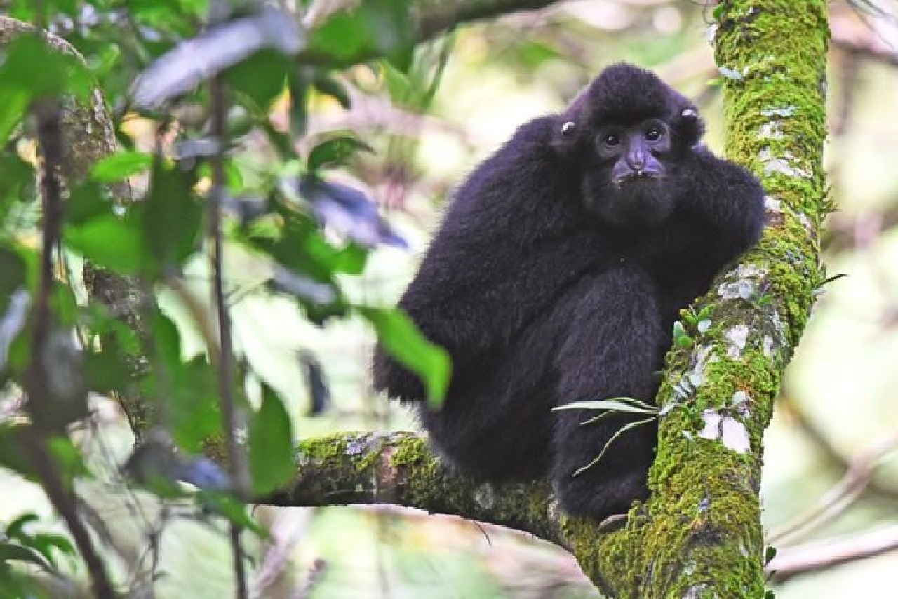

```{r setup, include=FALSE}
knitr::opts_chunk$set(echo = FALSE)
```

# I. Source Of The Article

- Learn More About This Article : *https://www.bbc.com/news/science-environment-54557877*

- Publication Date : *October 15, 2020*

- Word Count : *500*


# II. Vocabulary
|     Word From The Text    |     Synomym/Definition   in inglish    |     French Translation       |
|---------------------------|----------------------------------------|------------------------------|
|     Roam                  |     Stroll, prowl                      |     Errer                    |
|     Swinging              |     Waving                             |     Balançant                |
|     Handrail              |     Handhole                           |     Comme   main courante    |
|     Bounced               |     Rebond                             |     Rebondi                  |
|     Poaching              |     Smuggle                            |     Braconnage               |
|     Foraging              |     Rummage, searching                 |     Recherche                |

# III. Analysis Table About The Study
|     Themes                                  |     Article Content                                                                                                                                                                                                                                                                                                                                                                                                                                                           |
|---------------------------------------------|-------------------------------------------------------------------------------------------------------------------------------------------------------------------------------------------------------------------------------------------------------------------------------------------------------------------------------------------------------------------------------------------------------------------------------------------------------------------------------|
|     Researchers   ?                         |     Helen Briggs *(BBC Environment correspondent)*.                                                                                                                                                                                                                                                                                                                                                                                                                             |
|     Published In ? When ? *(if mentioned)*    |     BBC News/science & environment, 15 october 2020.                                                                                                                                                                                                                                                                                                                                                                                                                          |
|     General   Topic                         |     In Hainan, a landslide has torn a gap in the forest and the Gibbon   (Nomascus hainanus) have difficulty to live. Therefore, Scientists built a   rope bridge reconnecting the trees and help temporary the rarest primate in   the world.                                                                                                                                                                                                                                |
|     Procedure/   What Was Examined ?        |     In the group of 9 gibbons, all individuals knows how to use the rope   bridge perfectly because they climb and swing very easily. Some used the   ropes for swung by their arms and other more daring walked the tightrope.   Except one adult male which made a mighty jump from one tree to another,   sometimes accompanied by athletic teenage companions.  Other primates, as orangutan, use the rope   bridges because Hainan Gibbon has learned them to use it.    |
|     Conclusions/   Discovery                |     In 2003, there were only 2 groups with a total of 13 individuals in   the entire world. There was a slight recovery with the appearance of 2 new   groups in 2011 and 2015. Luckily, a fifth group appeared at the start of 2020   and the world population has bounced back to over 30 individuals. It shows   the species is slowly recovering.                                                                                                                         |
|     Remaining   Questions                   |     20 species of gibbons exist in the world, but they are almost all   threatened. They are as well almost all classified as Critically Endangered   by the International Union for the Conservation of Nature.                                                                                                                                                                                                                                                              |
