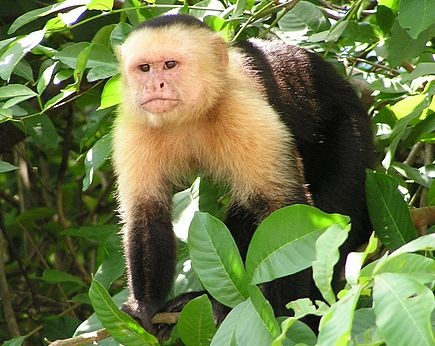

```{r setup, include=FALSE}
knitr::opts_chunk$set(echo = FALSE)
```

# I. Source Of The Article

- Learn More About This Article : *https://www.sciencedaily.com/releases/2020/12/201218112531.htm*

- Publication Date : *December 18, 2020*

- Word Count : *831*


# II. Vocabulary
|     Word From The Text    |     Synomym/Definition   in inglish                                                |     French Translation      |
|---------------------------|------------------------------------------------------------------------------------|-----------------------------|
|     Reluctant             |     Unwilling, hesitant                                                            |     Réticent                |
|     Committed             |     Feeling   dedication to a cause, of activity                                   |     Engagé                  |
|     Sunk costs            |     Refers   to money that has already been spent and which cannot be recovered    |     Coûts irrécupérables    |
|     Endeavor              |     Try   hard to do or achieve something                                          |     Effort                  |
|     Sooner                |     Earlier                                                                        |     Plus tôt                |
|     Embedded              |     Integrated                                                                     |     Intégré                 |
|     Epitome               |     Example                                                                        |     Exemple                 |
|     Heartache             |     Grief,   sorrow                                                                |     Chagrin                 |

# III. Analysis Table About The Study
|     Themes                                  |     Article Content                                                                                                                                                                                                                                                                                                                                                                                                                          |
|---------------------------------------------|----------------------------------------------------------------------------------------------------------------------------------------------------------------------------------------------------------------------------------------------------------------------------------------------------------------------------------------------------------------------------------------------------------------------------------------------|
|     Researchers ?                           |     Bruce Bower (Studies behavioral sciences for   Science News since 1984 and writes about psychology, anthropology,   archaeology and mental health issues).                                                                                                                                                                                                                                                                               |
|     Published In ? When ? *(if mentioned)*    |     Science Daily, 18   december 2020.                                                                                                                                                                                                                                                                                                                                                                                                       |
|     General Topic                           |     Monkeys, like humans, persist at tasks that they have   already invested in.                                                                                                                                                                                                                                                                                                                                                             |
|     Procedure/ What   Was Examined ?        |     A study shows that   capuchin monkeys and rhesus macaques are sensitive to a human behavior. It’s   about the reluctantce to give up on something they've already committed   time and effort to. Capuchin Monkeys and Rhesus Macaques participated in   cognitive and behavioral research. It can be a mechanism that helps us   balance overall costs and benefits, and which can be influenced by   uncertainty about the outcome.    |
|     Conclusions/   Discovery                |     The researchers found   that both species of monkeys took longer to achieve the performance, and the   more they tried, the more they tried to accomplish the whole task. Monkeys   were less susceptible to sunk cost behavior. Further, this behavior is   probably motivated by evolution. It reminds us that sometimes there is a good   reason to give up.                                                                          |
|     Remaining   Questions                   |     /                                                                                                                                                                                                                                                                                                                                                                                                                                        |
